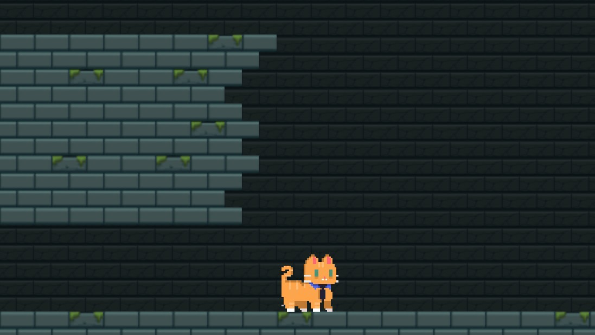
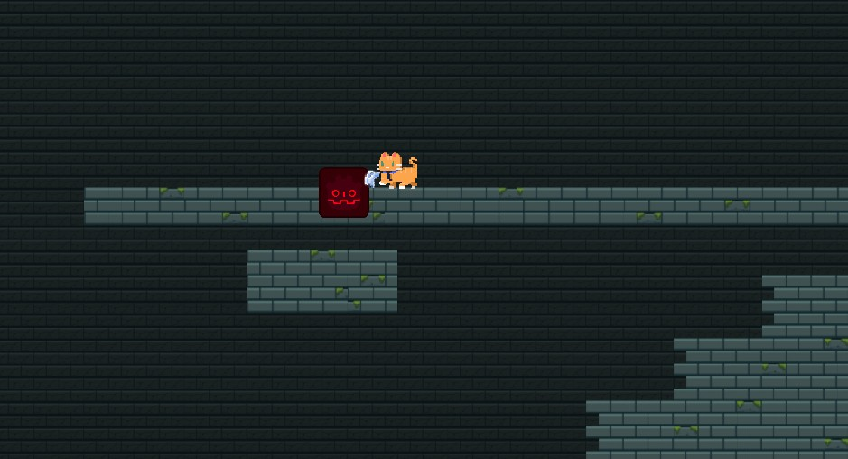
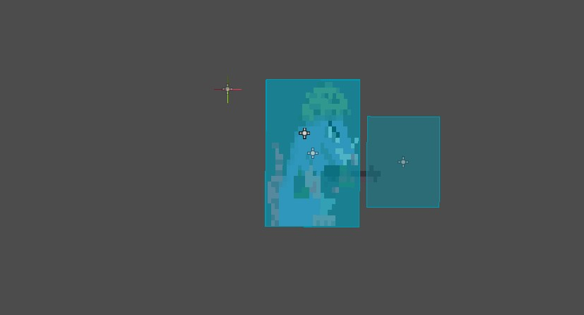
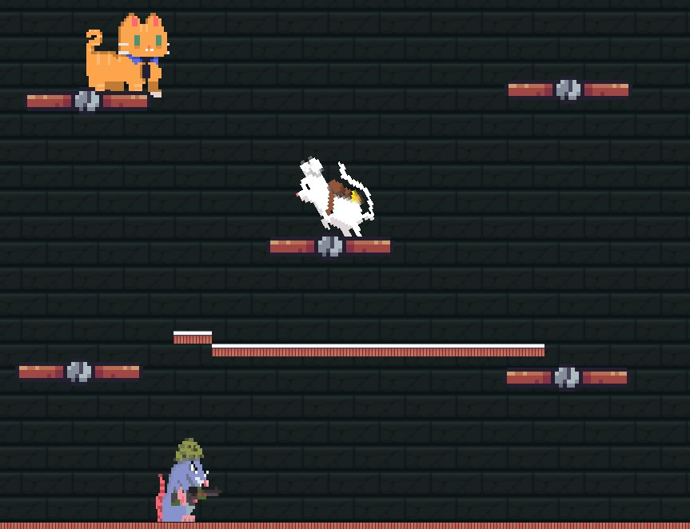
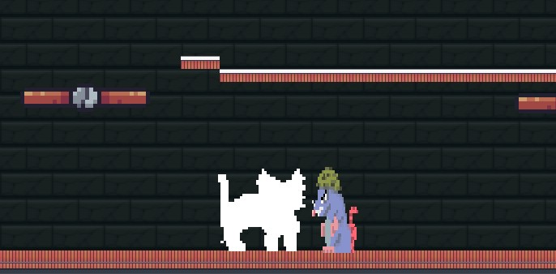
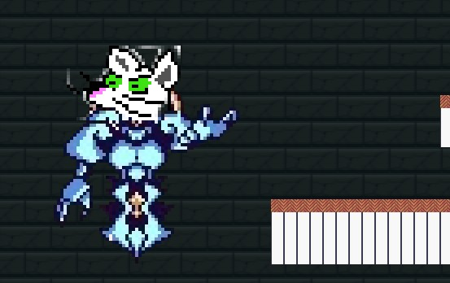

# Cat Nip
MASTER  BRANCH
## Descripción
Cat Nip es un juego desarrollado con Godot Engine.

## Características
- Juego de aventuras con gatos
- Gráficos en 2D
- Mecánicas de juego emocionantes

## Instalación
1. Clona este repositorio.
2. Abre Godot Engine.
3. Haz clic en "Importar" y selecciona la carpeta del proyecto.
4. Haz doble clic en el archivo `project.godot` para abrir el proyecto.

## 📸 Capturas destacadas

| | |
|---|---|
|  | **Prototipo inicial** – prueba de tileset y control básico del gato. |
|  | **Combate temprano** contra el slime rojo (hitbox + animación de ataque). |
|  | **Depuración de colisiones**: caja de daño y caja de impacto en la rata guerrera. |
|  | **Sección de plataformas** verticales con tornillos móviles. |
|  | **IA enemiga**: detección de silueta del gato y señal de ataque. |
|  | **Jefe final (WIP)**: animación preliminar y escenario dedicado. |

## Contribución
Si deseas contribuir a este proyecto, sigue estos pasos:
1. Haz un fork de este repositorio.
2. Crea una rama con tu nueva funcionalidad: `git checkout -b nueva-funcionalidad`.
3. Realiza los cambios necesarios y haz commit: `git commit -m "Agrega nueva funcionalidad"`.
4. Haz push a la rama: `git push origin nueva-funcionalidad`.
5. Abre un pull request en este repositorio.

## Licencia
Este proyecto está bajo la Licencia MIT. Consulta el archivo [LICENSE](./LICENSE) para más detalles.
