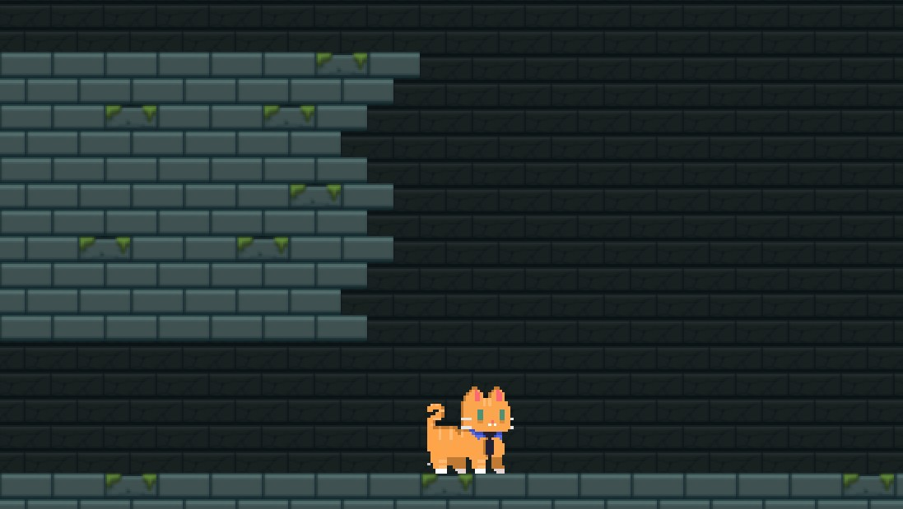
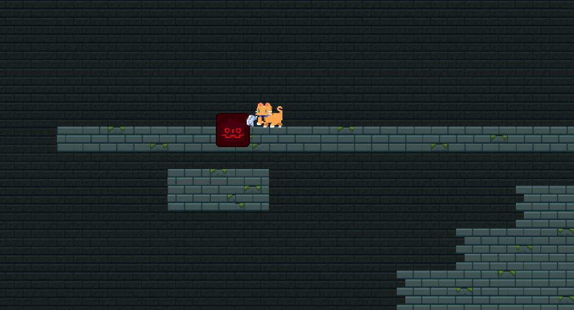
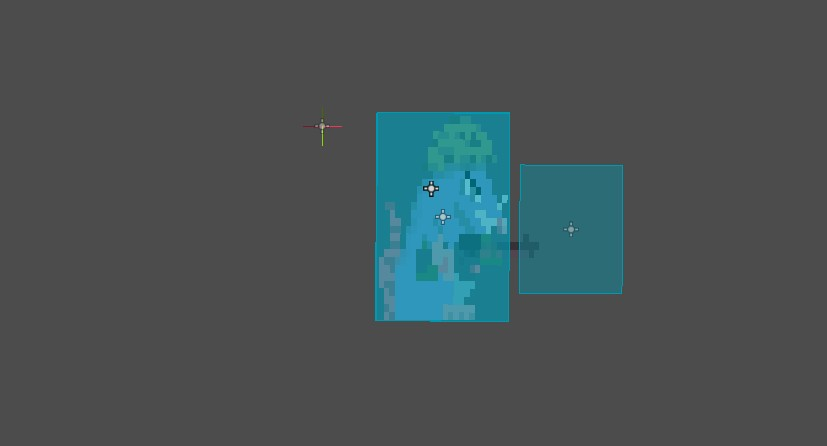
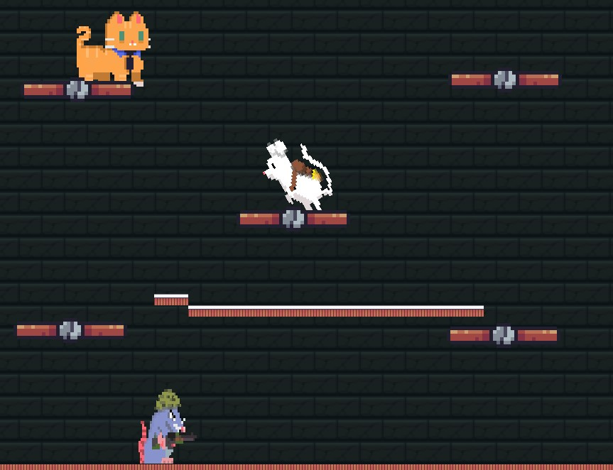
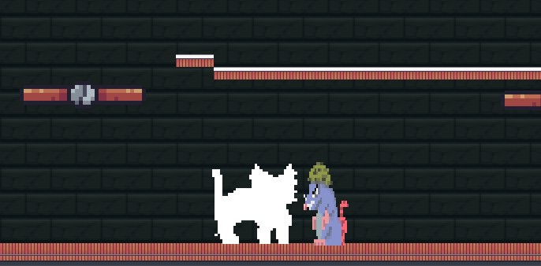
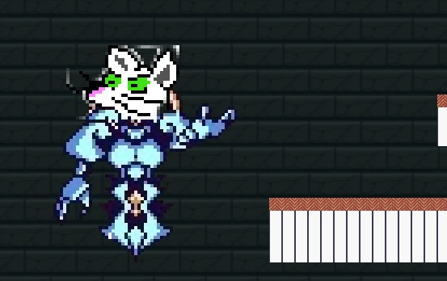

**[English](readme.md) · [Español](readme.es.md)**

---

# Cat-Nip

2D platformer & puzzle game built with **Godot Engine** and **GDScript** as a university project. I led the programming side: designed enemy AI, the final boss, and set up the pixel-art animation pipeline.

Author: [sebpost2](https://github.com/sebpost2)

---

## My role

- **Lead programmer** on the team.
- **Enemy AI**: patrol, detect, attack and stun states. Detection lines based on the cat's silhouette and a pre-attack telegraph cue.
- **Final boss**: phase-based attack patterns, hitboxes, dedicated animations and a custom arena.
- **Pixel-art animation pipeline**: integration of sprite sheets, state machines and pose blending.
- **Movement mechanics**: jump, double jump, basic attack and special attacks (including the "tornado").
- **Combat system**: damage boxes, hit boxes and visual feedback.

## Featured screenshots

| | |
|---|---|
|  | **Initial prototype** — tileset test and basic cat controls. |
|  | **Early combat** against the red Godot icon (hitbox + attack animation). |
|  | **Collision debugging**: damage box and hit box on the warrior rat. |
|  | **Special attacks** — the cat's tornado attack. |
|  | **Enemy AI**: cat-silhouette detection and pre-attack telegraph. |
|  | **Final boss (WIP)**: preliminary animation and dedicated arena. |

## Stack

| Layer | Technology |
|---|---|
| Engine | Godot 4 |
| Language | GDScript |
| Art | Pixel-art (custom sprite sheets) |
| Audio | SFX and music bundled as project resources |

## Project structure

```
├── Assets/        # Sprites, tilesets, fonts
├── Bosses/        # Boss scenes and scripts
├── Componentes/   # Reusable components (hitbox, hurtbox, etc.)
├── Enemigos/      # Enemy scenes, animations and AI
├── Game/          # Levels, game manager
├── Global/        # Singletons (autoload) — global state and managers
├── Player/        # Cat scene, animations and scripts
├── Sounds/        # SFX and music
└── project.godot
```

## Running locally

1. Clone this repository.
2. Open Godot Engine 4.
3. In the Godot launcher click **Import** and select the project folder.
4. Double-click `project.godot` to open it.
5. Press F5 to run.

## License

This project is licensed under the MIT License. See the [LICENSE](./LICENSE) file for details.

---

Built as a university project by the team. Programming led by [sebpost2](https://github.com/sebpost2).
